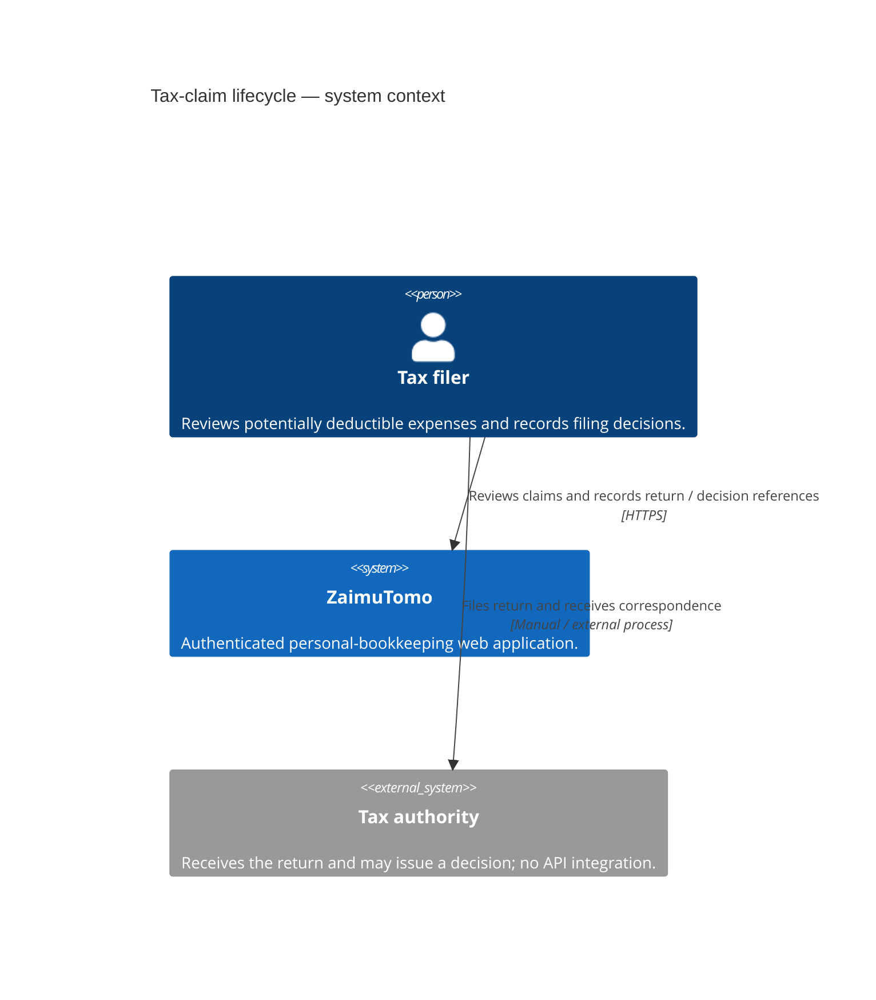
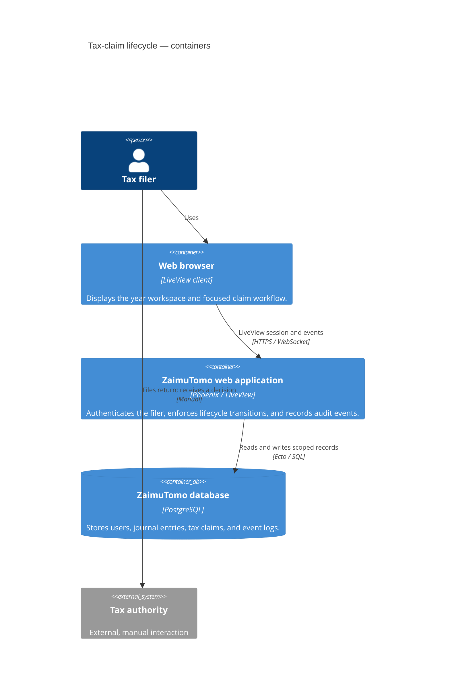
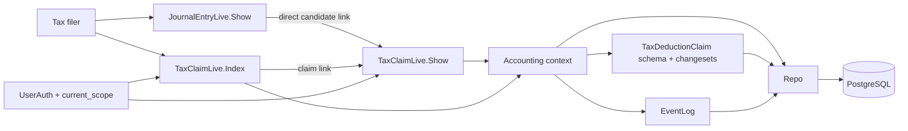
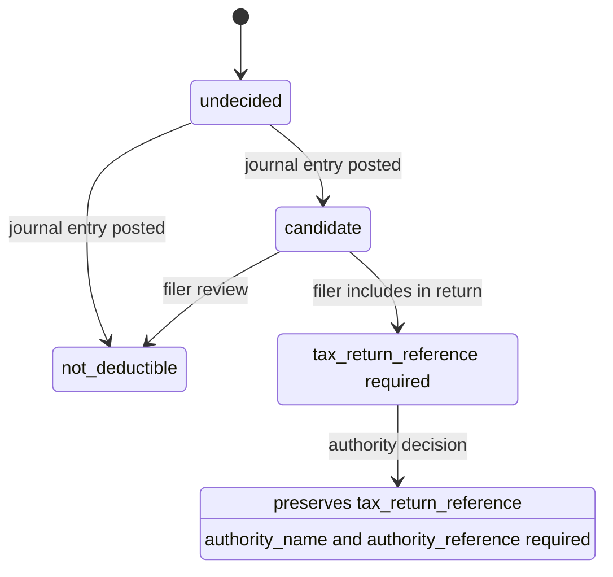
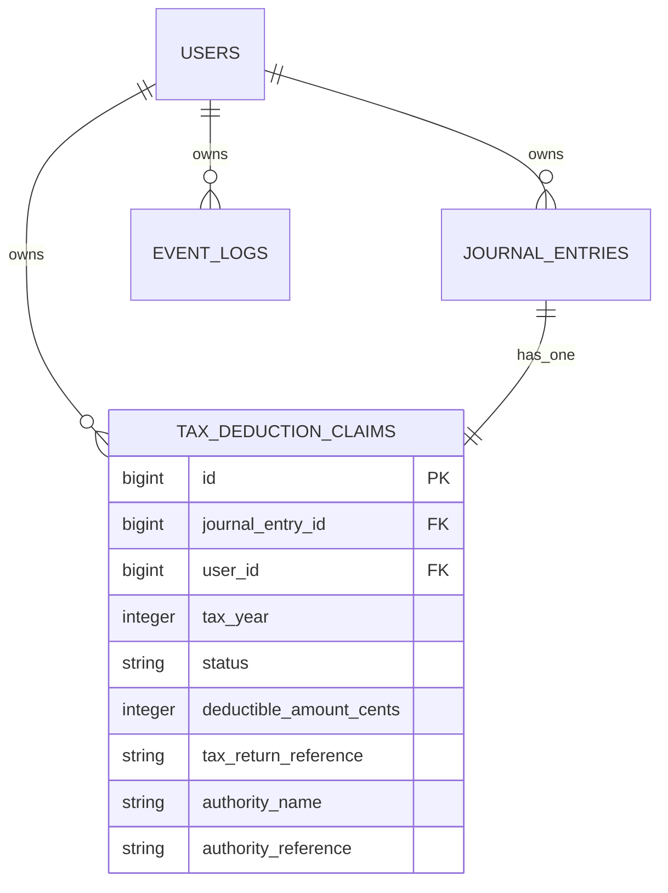

# Tax-claim lifecycle — C4 analysis

## Purpose and scope

The tax-claim lifecycle helps a tax filer work through expenses that may be deductible for a tax year, record the expenses included in a return, and retain the context of a later authority disallowance.

The workflow deliberately distinguishes:

- the filer deciding an expense is not deductible; and
- a tax authority disallowing an expense that was already included in a return.

The authority is not integrated with ZaimuTomo. The filer records information from the return and any authority correspondence manually.

## Level 1 — System context



**Boundary:** ZaimuTomo is the system of record for the filer's bookkeeping and claim evidence. It does not submit tax returns or decide deductibility on behalf of an authority.

## Level 2 — Containers



| Container | Responsibility | Important boundary |
| --- | --- | --- |
| Browser | Shows `/tax_claims?tax_year=YYYY`, `/tax_claims/:id`, and journal-entry links. | Never decides a transition itself; it submits an intent. |
| Phoenix application | Authenticates the current user, scopes reads/writes, validates transitions, and writes audit events atomically with the claim update. | Routes are inside the authenticated `:require_authenticated_user` LiveView session. |
| PostgreSQL | Persists claim state and cross-record invariants. | `tax_deduction_claims` has one row per journal entry, a `(user_id, tax_year)` index, valid-status checks, and conditional context checks. |
| Tax authority | External actor whose decision is entered by the filer. | No API, scraping, or automatic status update exists. |

## Level 3 — Components in the Phoenix application



| Component | Actual responsibility |
| --- | --- |
| `TaxClaimLive.Index` | Chooses the latest available tax year by default, groups scoped claims into candidate, claimed, not-deductible, and disallowed sections, and links to a claim workspace. |
| `TaxClaimLive.Show` | Provides the focused action workspace. A candidate can be filed or marked not deductible. A claimed record is calm by default; the authority-decision form is revealed only after an explicit action. |
| `JournalEntryLive.Show` | Displays tax treatment and links a candidate directly to its claim workspace rather than a generic queue. |
| `Accounting` | Owns scoped lookup/list APIs and named transition operations: `review_tax_deduction_claim/3` and `record_tax_authority_decision/3`. |
| `TaxDeductionClaim` | Owns input normalization, transition-specific validation, lifecycle effects, and database-constraint mapping. |
| `EventLog` | Receives a completed audit event inside the same database transaction as a successful transition. |

## Level 4 — Code and data model



### Core records



### Transition contract

| Source state | Operation | Target state | Required context | Effect |
| --- | --- | --- | --- | --- |
| `candidate` | `Accounting.review_tax_deduction_claim/3` | `claimed` | `tax_return_reference` | Retains the deductible amount and clears authority context. |
| `candidate` | `Accounting.review_tax_deduction_claim/3` | `not_deductible` | None | Sets deductible amount to zero and clears return/authority context. |
| `claimed` | `Accounting.record_tax_authority_decision/3` | `disallowed` | `authority_name`, `authority_reference` | Sets deductible amount to zero and retains the original return reference. |

Each accepted transition is performed through an `Ecto.Multi`: update the claim, insert the matching completed `EventLog` event, then commit both or neither. The update result is preloaded with its journal entry before a LiveView re-render.

### Security and integrity

- The router places both tax-claim routes in the existing authenticated browser pipeline and `:require_authenticated_user` LiveView session.
- Context queries include `claim.user_id == ^current_scope.user.id`; an unscoped claim is never returned to the LiveView.
- Database checks enforce valid status values and required return/authority context for `claimed` and `disallowed` states.
- State-transition direction is intentionally owned by the `Accounting` context rather than a database transition trigger. Direct SQL by a sufficiently privileged database role could bypass that application rule.
- PostgreSQL row-level security is not enabled today. It would be a separate cross-cutting hardening project requiring a transaction-local application-user setting on every pooled connection, plus policies for all tenant-owned tables. It complements—not replaces—the scoped context queries.

## Data flow

```mermaid
sequenceDiagram
  actor Filer
  participant Show as TaxClaimLive.Show
  participant Accounting
  participant DB as PostgreSQL

  Filer->>Show: Include candidate in tax return + reference
  Show->>Accounting: review_tax_deduction_claim(scope, claim_id, claimed attrs)
  Accounting->>DB: scoped candidate lookup
  Accounting->>DB: transaction: update claim + insert event
  DB-->>Accounting: committed claimed claim
  Accounting-->>Show: preloaded claim
  Show-->>Filer: return reference; no authority action required

  Note over Filer,DB: Only if the authority later responds
  Filer->>Show: Record tax authority decision
  Show-->>Filer: reveal disallowance form
  Filer->>Show: authority name + decision reference
  Show->>Accounting: record_tax_authority_decision(scope, claim_id, disallowed attrs)
  Accounting->>DB: scoped claimed lookup
  Accounting->>DB: transaction: update claim + insert event
  DB-->>Show: disallowed claim retaining return reference
```

## Deliberate non-goals and next decisions

1. **No `TaxReturn` aggregate yet.** The return reference is a string because the current workflow only needs a human-readable link to the filing. Introduce a `TaxReturn` record when a return needs multiple claims, filing dates, attachments, or amendment history.
2. **No partial authority outcome.** `disallowed` currently means the claim's deductible amount becomes zero. A partially accepted claim requires an explicit accepted/adjusted amount and a decision model rather than overloading the current status.
3. **No automated authority integration.** Correspondence remains user-entered. Any future document ingestion should link an authority document to a claim without automatically changing status.
4. **No database-enforced transition graph.** The context is the sole application writer. If additional writers are introduced—imports, APIs, or admin tools—either route them through the context or add a database trigger/state-transition table.
