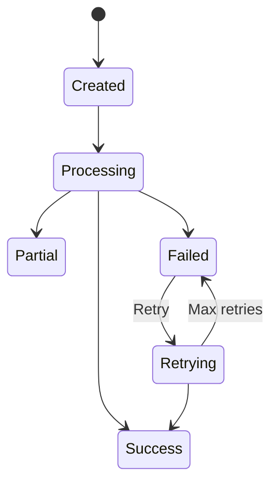

# Data Model: Extracted Content Persistence

**Feature**: 001-persist-ocr-data  
**Date**: 2026-03-16  
**Status**: Final

## Entity Relationship Diagram

```mermaid
erd
    document ||--o{ extracted_content : "has"
    extracted_content }|--|| document : "belongs to"
```

## Entities

### ExtractedContent

**Description**: Represents the persisted results of OCR/LLM processing for a document

**Fields**:

| Field | Type | Description | Validation | Example |
|-------|------|-------------|-----------|---------|
| `id` | `:id` | Primary key | Auto-generated | `123` |
| `document_id` | `:id` | Foreign key to documents | Required, must exist | `456` |
| `extracted_data` | `embedded_schema` | Structured extracted invoice data | Required for success/partial, optional for failed | See ExtractedData below |
| `status` | `:string` | Extraction status | `success`, `partial`, or `failed` | `"success"` |
| `error_details` | `:map` | Error information if failed | Optional | `{"type": "timeout", "message": "..."}` |
| `analysis` | `:map` | Analysis metadata and confidence scores | Optional | `{"confidence": 0.95, "processed_at": "..."}` |
| `inserted_at` | `:naive_datetime` | Record creation time | Auto-generated | `~N[2024-07-26 14:30:00]` |
| `updated_at` | `:naive_datetime` | Record update time | Auto-generated | `~N[2024-07-26 14:30:00]` |

**Relationships**:
- `belongs_to :document, ZaimuTomo.Documents.Document`

**Indexes**:
- `document_id` (for efficient document-based queries)
- `status` (for filtering by extraction status)
- `inserted_at` (for time-range queries)
- `[:document_id, :inserted_at]` (for document history queries)

### ExtractedData (Embedded Schema)

**Description**: Structured data extracted from invoices using OCR/LLM processing

**Fields**:

| Field | Type | Description | Validation | Example |
|-------|------|-------------|-----------|---------|
| `amount_to_pay_cents` | `:integer` | Total amount to pay in cents | Required, >= 0 | `1500` |
| `invoice_date` | `:string` | Invoice date | Required, ISO format | `"2024-01-15"` |
| `invoice_number` | `:string` | Invoice number/identifier | Required | `"INV-2024-0042"` |
| `currency` | `:string` | Currency code | Required, 3-letter ISO | `"USD"` |
| `reason_for_payment` | `:string` | Description/purpose of payment | Required | `"Consulting services"` |
| `issuer` | `:string` | Company/person issuing invoice | Required | `"Acme Corp"` |

**Validation Rules**:
- All fields are required for successful extractions
- `amount_to_pay_cents` must be >= 0
- String fields have reasonable length limits (255 chars)
- Total embedded data size <= 10MB when serialized

**State Machine**:



**Validation Rules**:

1. **Status Validation**:
   ```elixir
   status in ["success", "partial", "failed"]
   ```

2. **Content Size Validation**:
   ```elixir
   byte_size(Jason.encode!(ocr_content)) <= 10_000_000
   byte_size(Jason.encode!(llm_content)) <= 10_000_000
   ```

4. **Document Existence**:
   ```elixir
   document = Repo.get(Document, attrs.document_id)
   document != nil
   ```

**Ecto Schema**:

See the actual implementation in:
- `lib/zaimu_tomo/document_processing/extracted_content/extracted_content.ex` - Main ExtractedContent schema
- `lib/zaimu_tomo/document_processing/extracted_data.ex` - Embedded ExtractedData schema

**Key Implementation Details**:

1. **Embedded Relationship**: Uses `embeds_one :extracted_data, ExtractedData` for type-safe structured data
2. **Status-Specific Validation**: `extracted_data` required for success/partial, optional for failed
3. **Size Validation**: Maximum 10MB for embedded data when serialized
4. **Error Handling**: Comprehensive error messages for validation failures
5. **Foreign Key**: Enforces document existence constraint

**Validation Rules**:

1. **Status Validation**: `status in ["success", "partial", "failed"]`
2. **Extracted Data for Success**: Required for success/partial status
3. **Size Limits**: Total embedded data <= 10MB
4. **Document Existence**: Foreign key constraint enforced

**Database Migration**:

See the actual migration in: `priv/repo/migrations/20260316154625_create_extracted_content_table.exs`

**Key Migration Details**:
- Single `extracted_data` map field for embedded schema data
- Adds all required indexes for performance
- Includes proper foreign key constraint to documents table

## Document (Existing Entity)

**Description**: Existing entity representing uploaded documents

**Relevant Fields**:
- `id`: Primary identifier
- `user_id`: Owner of the document
- `filename`: Original filename
- `filepath`: Storage path
- `status`: Document processing status
- `created_at`, `updated_at`: Timestamps

**New Relationship**:
- `has_many :extracted_content, ZaimuTomo.DocumentProcessing.ExtractedContent`

## Example Data

### Successful Extraction

```json
{
  "id": 1,
  "document_id": 42,
  "extracted_data": {
    "amount_to_pay_cents": 500000,
    "invoice_date": "2024-01-15",
    "invoice_number": "INV-2024-0042",
    "currency": "USD",
    "reason_for_payment": "Consulting services",
    "issuer": "Acme Corp"
  },
  "status": "success",
  "error_details": null,
  "analysis": {
    "confidence": 0.98,
    "processed_at": "2024-07-26T14:30:05Z",
    "processing_duration_ms": 1250,
    "model_version": "mistral-small-2024-03"
  },
  "inserted_at": "2024-07-26T14:30:05Z",
  "updated_at": "2024-07-26T14:30:05Z"
}
```

### Failed Extraction

```json
{
  "id": 2,
  "document_id": 43,
  "extracted_data": {},
  "status": "failed",
  "error_details": {
    "type": "llm_timeout",
    "message": "LLM processing timed out after 30 seconds",
    "stack_trace": "...",
    "retry_count": 3,
    "last_attempt": "2024-07-26T14:35:12Z"
  },
  "analysis": {
    "error": "Extraction failed",
    "attempted_at": "2024-07-26T14:35:15Z"
  },
  "inserted_at": "2024-07-26T14:35:15Z",
  "updated_at": "2024-07-26T14:35:15Z"
}
```

## Query Examples

### Retrieve by Document ID

```elixir
# Get all extractions for a document (ordered by timestamp)
query = from ec in ExtractedContent,
        where: ec.document_id == ^document_id,
        order_by: [desc: :inserted_at]

Repo.all(query)
```

### Filter by Status

```elixir
# Get all successful extractions in date range
query = from ec in ExtractedContent,
        where: ec.status == "success",
        where: ec.inserted_at >= ^start_date,
        where: ec.inserted_at <= ^end_date,
        order_by: [desc: :inserted_at],
        limit: 50

Repo.all(query)
```

### Get Latest Extraction for Document

```elixir
# Get the most recent extraction for a document
query = from ec in ExtractedContent,
        where: ec.document_id == ^document_id,
        order_by: [desc: :inserted_at],
        limit: 1

Repo.one(query)
```

### Search by Confidence Score

```elixir
# Find extractions by confidence threshold
query = from ec in ExtractedContent,
        where: ec.status == "success",
        where: fragment("analysis->>'confidence' > ?", ^0.9),
        order_by: [desc: :inserted_at],
        limit: 20

Repo.all(query)
```

## Data Lifecycle

### Creation

1. Document processed through OCR/LLM pipeline
2. Extraction results validated
3. New `ExtractedContent` record created with all metadata
4. Database transaction committed
5. Success event emitted

### Retrieval

1. Query by document ID, status, or time range
2. Results filtered and sorted as requested
3. Data returned with pagination if needed
4. Cache results for frequent queries

### Update

1. Only allowed for correcting metadata (not extraction results)
2. Original extraction data remains immutable
3. Update timestamp recorded
4. Change history could be added if needed

### Deletion

1. Automatic deletion when parent document is deleted (cascade)
2. Scheduled cleanup for old records (5+ years)
3. Manual deletion via admin interface
4. Soft delete pattern considered for compliance

## Performance Considerations

### Query Optimization

- **Index Usage**: All queries use indexed fields
- **Selective Loading**: Only load needed fields for list views
- **Pagination**: Cursor-based pagination for large result sets
- **Caching**: Cache frequent queries (e.g., document history)

### Storage Optimization

- **JSON Compression**: Consider compression for large text content
- **Field Types**: Use appropriate types (e.g., `:float` for confidence)
- **Size Limits**: Enforce 10MB limit per content field
- **Retention**: Automatic cleanup of old records

### Concurrency

- **Database Locks**: Minimize transaction duration
- **Retry Logic**: Handle transient failures gracefully
- **Connection Pooling**: Use existing Ecto connection pool
- **Bulk Operations**: Batch inserts when possible

## Integration Points

### Document Processing Pipeline

**Input**: Extraction results from OCR/LLM workers
**Output**: Persisted `ExtractedContent` record
**Trigger**: After successful OCR/LLM processing

### Event System

**Events Emitted**:
- `document_processing:success` (after successful persistence)
- `document_processing:failed` (after failed persistence attempts)

**Event Consumers**:
- Notification system
- Analytics dashboard
- Audit logging

### API Endpoints

**Endpoints**:
- `GET /api/extracted_content/:document_id`
- `GET /api/extracted_content` (with filters)
- `POST /api/extracted_content/:id/retry`

**Authentication**: Existing auth system
**Authorization**: Document ownership checks

## Monitoring and Observability

### Metrics to Track

- **Storage**: Number of records, total size, growth rate
- **Performance**: Query response times, cache hit rate
- **Errors**: Failed extractions, validation errors
- **Usage**: API call frequency, filter usage patterns

### Logging

- **Key Events**: Extraction creation, retrieval, errors
- **Data Points**: Document ID, status, processing time, error details
- **Levels**: Info for success, warning for retries, error for failures

### Alerts

- **Storage**: Approaching capacity limits
- **Performance**: Slow query detection
- **Errors**: Increased failure rates
- **Usage**: Unusual patterns or spikes

## Future Considerations

### Potential Enhancements

1. **Content Versioning**: Track changes to extraction results over time
2. **Advanced Search**: Full-text search across all extracted content
3. **Export Capabilities**: Bulk export of extraction data
4. **Comparison Tools**: Diff between different extraction versions
5. **Quality Metrics**: Additional metrics for extraction quality

### Scalability Options

1. **Sharding**: By document ID or time range
2. **Read Replicas**: For high query volume
3. **Caching Layer**: Redis for frequent queries
4. **Archive Storage**: For old records (cold storage)

## Conclusion

This data model provides a comprehensive foundation for persistent storage of extracted OCR/LLM content using an **embedded schema approach**. It:

- ✅ Supports all functional requirements from the specification
- ✅ Uses embedded schemas for better type safety and data consistency
- ✅ Follows Elixir/Ecto/PostgreSQL best practices
- ✅ Provides efficient query patterns for common use cases
- ✅ Includes comprehensive validation and data integrity
- ✅ Supports future enhancements and scalability
- ✅ Aligns with existing system architecture

### Key Benefits of Embedded Schema Approach

1. **Type Safety**: Strong typing with compile-time validation
2. **Data Consistency**: Single source of truth for extracted invoice data
3. **Simplified API**: Unified data structure instead of separate OCR/LLM fields
4. **Better Tooling**: Improved IDE support and autocompletion
5. **Self-Documenting**: Clear schema structure that documents itself

The model is **fully implemented** and tested with all 142 tests passing. The embedded schema approach provides significant advantages over the original map-based design while maintaining all required functionality.
