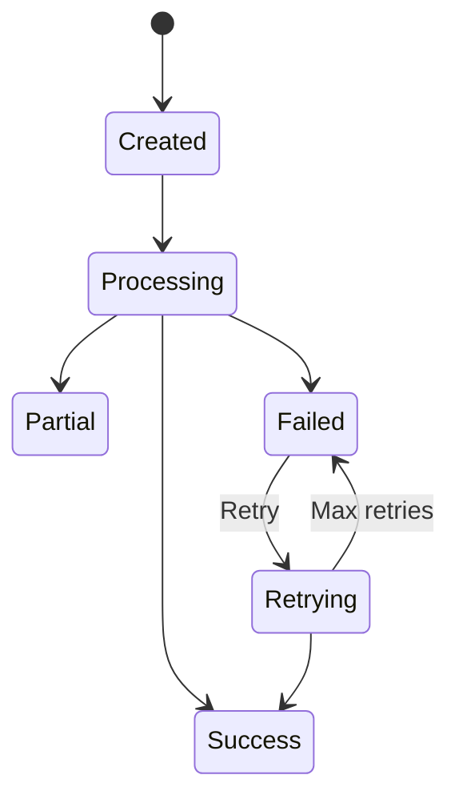

# Data Model: Extracted Content Persistence

**Feature**: 001-persist-ocr-data  
**Date**: 2026-03-16  
**Status**: Final

## Entity Relationship Diagram

```mermaid
erd
    document ||--o{ extracted_content : "has"
    extracted_content }|--|| document : "belongs to"
```

## Entities

### ExtractedContent

**Description**: Represents the persisted results of OCR/LLM processing for a document

**Fields**:

| Field | Type | Description | Validation | Example |
|-------|------|-------------|-----------|---------|
| `id` | `:id` | Primary key | Auto-generated | `123` |
| `document_id` | `:id` | Foreign key to documents | Required, must exist | `456` |
| `ocr_content` | `:map` | Raw text extracted by OCR | Required, max 10MB | `{"text": "...", "pages": [...]}` |
| `llm_content` | `:map` | Enhanced content from LLM | Required, max 10MB | `{"entities": [...], "summary": "..."}` |
| `confidence_score` | `:float` | Quality metric (0-1) | 0.0 ≤ score ≤ 1.0 | `0.95` |
| `status` | `:string` | Extraction status | `success`, `partial`, or `failed` | `"success"` |
| `error_details` | `:map` | Error information if failed | Optional | `{"type": "timeout", "message": "..."}` |
| `ocr_version` | `:string` | OCR model version used | Required | `"v2.1.0"` |
| `llm_version` | `:string` | LLM model version used | Required | `"mistral-small-2.0"` |
| `processing_duration_ms` | `:integer` | Time taken for extraction | ≥ 0 | `1250` |
| `extraction_timestamp` | `:naive_datetime` | When extraction occurred | Auto-generated | `~N[2024-07-26 14:30:00]` |
| `inserted_at` | `:naive_datetime` | Record creation time | Auto-generated | `~N[2024-07-26 14:30:00]` |
| `updated_at` | `:naive_datetime` | Record update time | Auto-generated | `~N[2024-07-26 14:30:00]` |

**Relationships**:
- `belongs_to :document, ZaimuTomo.Documents.Document`

**Indexes**:
- `document_id` (for efficient document-based queries)
- `status` (for filtering by extraction status)
- `extraction_timestamp` (for time-range queries)
- `[:document_id, :extraction_timestamp]` (for document history queries)

**State Machine**:



**Validation Rules**:

1. **Status Validation**:
   ```elixir
   status in ["success", "partial", "failed"]
   ```

2. **Confidence Score Validation**:
   ```elixir
   0.0 <= confidence_score <= 1.0
   ```

3. **Content Size Validation**:
   ```elixir
   byte_size(Jason.encode!(ocr_content)) <= 10_000_000
   byte_size(Jason.encode!(llm_content)) <= 10_000_000
   ```

4. **Document Existence**:
   ```elixir
   document = Repo.get(Document, attrs.document_id)
   document != nil
   ```

**Ecto Schema**:

```elixir
defmodule ZaimuTomo.DocumentProcessing.ExtractedContent do
  use Ecto.Schema
  import Ecto.Changeset
  
  alias ZaimuTomo.Documents.Document
  
  schema "extracted_content" do
    field :ocr_content, :map
    field :llm_content, :map
    field :confidence_score, :float
    field :status, :string
    field :error_details, :map
    field :ocr_version, :string
    field :llm_version, :string
    field :processing_duration_ms, :integer
    field :extraction_timestamp, :naive_datetime
    
    belongs_to :document, Document
    
    timestamps()
  end
  
  def changeset(extracted_content, attrs) do
    extracted_content
    |> cast(attrs, [
      :document_id,
      :ocr_content,
      :llm_content,
      :confidence_score,
      :status,
      :error_details,
      :ocr_version,
      :llm_version,
      :processing_duration_ms,
      :extraction_timestamp
    ])
    |> validate_required([
      :document_id,
      :ocr_content,
      :llm_content,
      :status,
      :ocr_version,
      :llm_version,
      :processing_duration_ms
    ])
    |> validate_inclusion(:status, ["success", "partial", "failed"])
    |> validate_number(:confidence_score, greater_than_or_equal_to: 0.0, less_than_or_equal_to: 1.0)
    |> validate_content_size(:ocr_content)
    |> validate_content_size(:llm_content)
    |> foreign_key_constraint(:document_id)
  end
  
  defp validate_content_size(changeset, field) do
    content = get_field(changeset, field)
    
    case content do
      nil -> changeset
      _ ->
        size = byte_size(Jason.encode!(content))
        if size <= 10_000_000 do
          changeset
        else
          max_size = byte_size("10 MB")
          add_error(changeset, field, "exceeds maximum size of #{max_size} bytes")
        end
    end
  end
end
```

**Database Migration**:

```elixir
defmodule ZaimuTomo.Repo.Migrations.CreateExtractedContent do
  use Ecto.Migration
  
  def change do
    create table(:extracted_content) do
      add :document_id, references(:documents, on_delete: :delete_all), null: false
      add :ocr_content, :map, null: false
      add :llm_content, :map, null: false
      add :confidence_score, :float, null: false
      add :status, :string, null: false
      add :error_details, :map
      add :ocr_version, :string, null: false
      add :llm_version, :string, null: false
      add :processing_duration_ms, :integer, null: false
      add :extraction_timestamp, :naive_datetime, null: false
      
      timestamps()
    end
    
    create index(:extracted_content, [:document_id])
    create index(:extracted_content, [:status])
    create index(:extracted_content, [:extraction_timestamp])
    create index(:extracted_content, [:document_id, :extraction_timestamp])
  end
end
```

## Document (Existing Entity)

**Description**: Existing entity representing uploaded documents

**Relevant Fields**:
- `id`: Primary identifier
- `user_id`: Owner of the document
- `filename`: Original filename
- `filepath`: Storage path
- `status`: Document processing status
- `created_at`, `updated_at`: Timestamps

**New Relationship**:
- `has_many :extracted_content, ZaimuTomo.DocumentProcessing.ExtractedContent`

## Example Data

### Successful Extraction

```json
{
  "id": 1,
  "document_id": 42,
  "ocr_content": {
    "text": "INVOICE\nAcme Corp\n...",
    "pages": [
      {"page": 1, "text": "...", "words": [...]},
      {"page": 2, "text": "...", "words": [...]}
    ],
    "language": "en",
    "detected_text_regions": [...]
  },
  "llm_content": {
    "entities": [
      {"type": "company", "name": "Acme Corp", "confidence": 0.98},
      {"type": "date", "value": "2024-01-15", "confidence": 0.95}
    ],
    "summary": "Invoice from Acme Corp dated January 15, 2024 for consulting services",
    "amounts": [
      {"description": "Consulting services", "amount": 5000.00, "currency": "USD"}
    ],
    "key_value_pairs": {
      "Invoice Number": "INV-2024-0042",
      "Due Date": "2024-02-15"
    }
  },
  "confidence_score": 0.95,
  "status": "success",
  "error_details": null,
  "ocr_version": "v2.1.0",
  "llm_version": "mistral-small-2.0",
  "processing_duration_ms": 1250,
  "extraction_timestamp": "2024-07-26T14:30:00Z",
  "inserted_at": "2024-07-26T14:30:05Z",
  "updated_at": "2024-07-26T14:30:05Z"
}
```

### Failed Extraction

```json
{
  "id": 2,
  "document_id": 43,
  "ocr_content": {
    "text": "[PARTIAL EXTRACTION]",
    "pages": [{"page": 1, "text": "...", "confidence": 0.65}]
  },
  "llm_content": null,
  "confidence_score": 0.45,
  "status": "failed",
  "error_details": {
    "type": "llm_timeout",
    "message": "LLM processing timed out after 30 seconds",
    "stack_trace": "...",
    "retry_count": 3,
    "last_attempt": "2024-07-26T14:35:12Z"
  },
  "ocr_version": "v2.1.0",
  "llm_version": "mistral-small-2.0",
  "processing_duration_ms": 30500,
  "extraction_timestamp": "2024-07-26T14:35:00Z",
  "inserted_at": "2024-07-26T14:35:15Z",
  "updated_at": "2024-07-26T14:35:15Z"
}
```

## Query Examples

### Retrieve by Document ID

```elixir
# Get all extractions for a document (ordered by timestamp)
query = from ec in ExtractedContent,
        where: ec.document_id == ^document_id,
        order_by: [desc: :extraction_timestamp]

Repo.all(query)
```

### Filter by Status

```elixir
# Get all successful extractions in date range
query = from ec in ExtractedContent,
        where: ec.status == "success",
        where: ec.extraction_timestamp >= ^start_date,
        where: ec.extraction_timestamp <= ^end_date,
        order_by: [desc: :extraction_timestamp],
        limit: 50

Repo.all(query)
```

### Get Latest Extraction for Document

```elixir
# Get the most recent extraction for a document
query = from ec in ExtractedContent,
        where: ec.document_id == ^document_id,
        order_by: [desc: :extraction_timestamp],
        limit: 1

Repo.one(query)
```

### Search by Confidence Score

```elixir
# Find extractions with high confidence
query = from ec in ExtractedContent,
        where: ec.confidence_score >= 0.9,
        where: ec.status == "success",
        order_by: [desc: :confidence_score],
        limit: 20

Repo.all(query)
```

## Data Lifecycle

### Creation

1. Document processed through OCR/LLM pipeline
2. Extraction results validated
3. New `ExtractedContent` record created with all metadata
4. Database transaction committed
5. Success event emitted

### Retrieval

1. Query by document ID, status, or time range
2. Results filtered and sorted as requested
3. Data returned with pagination if needed
4. Cache results for frequent queries

### Update

1. Only allowed for correcting metadata (not extraction results)
2. Original extraction data remains immutable
3. Update timestamp recorded
4. Change history could be added if needed

### Deletion

1. Automatic deletion when parent document is deleted (cascade)
2. Scheduled cleanup for old records (5+ years)
3. Manual deletion via admin interface
4. Soft delete pattern considered for compliance

## Performance Considerations

### Query Optimization

- **Index Usage**: All queries use indexed fields
- **Selective Loading**: Only load needed fields for list views
- **Pagination**: Cursor-based pagination for large result sets
- **Caching**: Cache frequent queries (e.g., document history)

### Storage Optimization

- **JSON Compression**: Consider compression for large text content
- **Field Types**: Use appropriate types (e.g., `:float` for confidence)
- **Size Limits**: Enforce 10MB limit per content field
- **Retention**: Automatic cleanup of old records

### Concurrency

- **Database Locks**: Minimize transaction duration
- **Retry Logic**: Handle transient failures gracefully
- **Connection Pooling**: Use existing Ecto connection pool
- **Bulk Operations**: Batch inserts when possible

## Integration Points

### Document Processing Pipeline

**Input**: Extraction results from OCR/LLM workers
**Output**: Persisted `ExtractedContent` record
**Trigger**: After successful OCR/LLM processing

### Event System

**Events Emitted**:
- `document_processing:success` (after successful persistence)
- `document_processing:failed` (after failed persistence attempts)

**Event Consumers**:
- Notification system
- Analytics dashboard
- Audit logging

### API Endpoints

**Endpoints**:
- `GET /api/extracted_content/:document_id`
- `GET /api/extracted_content` (with filters)
- `POST /api/extracted_content/:id/retry`

**Authentication**: Existing auth system
**Authorization**: Document ownership checks

## Monitoring and Observability

### Metrics to Track

- **Storage**: Number of records, total size, growth rate
- **Performance**: Query response times, cache hit rate
- **Errors**: Failed extractions, validation errors
- **Usage**: API call frequency, filter usage patterns

### Logging

- **Key Events**: Extraction creation, retrieval, errors
- **Data Points**: Document ID, status, processing time, error details
- **Levels**: Info for success, warning for retries, error for failures

### Alerts

- **Storage**: Approaching capacity limits
- **Performance**: Slow query detection
- **Errors**: Increased failure rates
- **Usage**: Unusual patterns or spikes

## Future Considerations

### Potential Enhancements

1. **Content Versioning**: Track changes to extraction results over time
2. **Advanced Search**: Full-text search across all extracted content
3. **Export Capabilities**: Bulk export of extraction data
4. **Comparison Tools**: Diff between different extraction versions
5. **Quality Metrics**: Additional metrics for extraction quality

### Scalability Options

1. **Sharding**: By document ID or time range
2. **Read Replicas**: For high query volume
3. **Caching Layer**: Redis for frequent queries
4. **Archive Storage**: For old records (cold storage)

## Conclusion

This data model provides a comprehensive foundation for persistent storage of extracted OCR/LLM content. It:

- ✅ Supports all functional requirements from the specification
- ✅ Follows Elixir/Ecto/PostgreSQL best practices
- ✅ Provides efficient query patterns for common use cases
- ✅ Includes proper validation and data integrity
- ✅ Supports future enhancements and scalability
- ✅ Aligns with existing system architecture

The model is ready for implementation with no critical gaps or ambiguities.
