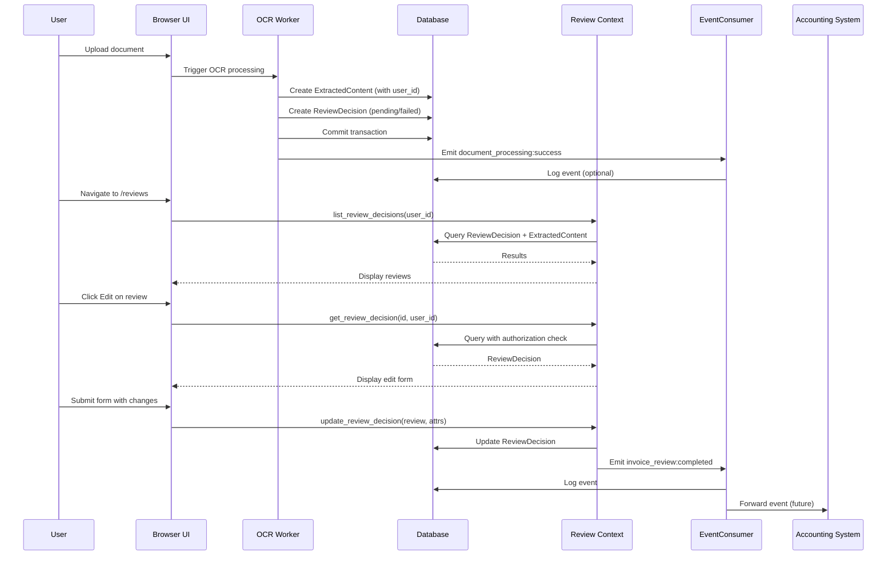

# Event Contracts: Review OCR/LLM Processed Data

## Event Types

### 1. invoice_review:completed

**Purpose**: Notifies that an invoice review has been completed (approved, rejected, or amended)

**Payload Structure**:
```elixir
%{
  invoice_id: integer(),        # Required: ID of the extracted_content record
  status: String.t(),          # Required: "approved", "rejected", or "amended"
  user_id: integer(),          # Required: ID of user who made the decision
  decision_data: map(),        # Optional: Map containing amended data
  timestamp: DateTime.t()     # Required: When the event occurred
}
```

**Example**:
```elixir
%{
  invoice_id: 42,
  status: "approved",
  user_id: 1,
  decision_data: %{
    "invoice_number" => "INV-2024-00123",
    "invoice_date" => "2024-03-18",
    "issuer" => "Acme Corp",
    "currency" => "USD",
    "amount_to_pay_cents" => 10000,
    "reason_for_payment" => "Services rendered"
  },
  timestamp: ~U[2024-03-18 14:30:45Z]
}
```

**Producers**:
- `ZaimuTomo.Review.approve_invoice/3`
- `ZaimuTomo.Review.reject_invoice/3`
- `ZaimuTomo.Review.amend_invoice/3`

**Consumers**:
- Accounting system (for financial processing)
- Audit log system (EventLog table)
- Notification system (to inform users)
- Analytics system

**Guarantees**:
- Event will be emitted after database transaction completes successfully
- Event will contain accurate reflection of database state
- Event will be persisted in event_logs table for audit purposes

---

### 2. document_processing:success (Produced - Existing from ocr_worker.ex)

**Purpose**: Notifies that OCR/LLM processing has successfully completed for a document

**Payload Structure** (exact implementation from ocr_worker.ex):
```elixir
%{
  document_id: integer(),        # Required: ID of the source document
  extraction_id: integer(),      # Required: ID of the extracted_content record
  user_id: integer(),            # Required: ID of the user who uploaded the document
  status: atom(),                # Required: Always :completed for success
  data: map(),                  # Required: OCR/LLM extracted data (ExtractedData struct)
  timestamp: DateTime.t()       # Required: When processing completed
}
```

**Implementation**:
- See `lib/zaimu_tomo/document_processing/ocr_worker.ex` lines 25-50
- Emitted via `Phoenix.PubSub.broadcast(ZaimuTomo.PubSub, "document_processing:success", payload)`

**Primary Consumer Action**:
- OCR worker directly creates ReviewDecision record with `review_status: "pending"` via `create_review_decision/3`
- This happens BEFORE the event is emitted, ensuring ReviewDecision always exists

**Secondary Consumers**:
- `ZaimuTomo.Review.EventConsumer` - Subscribes to this event (for future enhancements)
- Any other system that needs to know when document processing succeeds

---

### 3. document_processing:failed (Produced - Existing from ocr_worker.ex)

**Purpose**: Notifies that OCR/LLM processing has failed for a document

**Payload Structure** (exact implementation from ocr_worker.ex):
```elixir
%{
  document_id: integer(),        # Required: ID of the source document
  extraction_id: integer(),      # Required: ID of the extracted_content record
  user_id: integer(),            # Required: ID of the user who uploaded the document
  status: atom(),                # Required: Always :failed for failures
  error: any(),                  # Required: The error that occurred
  timestamp: DateTime.t()       # Required: When failure occurred
}
```

**Implementation**:
- See `lib/zaimu_tomo/document_processing/ocr_worker.ex` lines 52-95
- Emitted via `Phoenix.PubSub.broadcast(ZaimuTomo.PubSub, "document_processing:failed", payload)`

**Primary Consumer Action**:
- OCR worker directly creates ReviewDecision record with `review_status: "failed"` via `create_failed_review_decision/3`
- This happens BEFORE the event is emitted, ensuring ReviewDecision always exists

**Secondary Consumers**:
- `ZaimuTomo.Review.EventConsumer` - Subscribes to this event (for future enhancements)
- Any other system that needs to know when document processing fails

---

## Event Processing Contract

### Consumer Requirements

1. **Event Subscription**:
   - Must subscribe to Phoenix PubSub topics using `Phoenix.PubSub.subscribe/2`:
     - `"document_processing:success"`
     - `"document_processing:failed"`
   - Must start the consumer process (added to supervision tree in `application.ex`)

2. **Event Handling**:
   - Must process events within 5 seconds of receipt
   - Must implement retry logic for transient failures
   - Must log all processing errors
   - Must maintain processing order for same document_id

3. **Idempotency**:
   - Must handle duplicate events gracefully
   - Must use database constraints to prevent duplicate processing
   - Must implement idempotency keys where appropriate

4. **Error Handling**:
   - Must implement circuit breakers for repeated failures
   - Must alert administrators after 3 consecutive failures
   - Must implement dead letter queue for unprocessable events

### Producer Requirements (for invoice_review:completed)

1. **Event Emission**:
   - Must emit event after successful database transaction
   - Must include all required fields
   - Must use UTC timestamps
   - Must validate payload before emission
   - Use `Phoenix.PubSub.broadcast/3` with `ZaimuTomo.PubSub` module

2. **Payload Validation**:
   - invoice_id: Must be positive integer (extracted_content.id)
   - status: Must be one of ["approved", "rejected", "amended"]
   - user_id: Must be positive integer
   - timestamp: Must be valid DateTime in UTC

3. **Delivery Guarantees**:
   - At-least-once delivery
   - Events persisted in database (EventLog) before emission
   - Event ordering preserved per invoice_id

---

## Event Flow Contract



## Monitoring Contract

### Metrics to Track

1. **Event Processing**:
   - Events received per second
   - Processing latency (p50, p90, p99)
   - Error rate (% of events that fail processing)

2. **Event Emission**:
   - Events emitted per second
   - Emission latency (time from DB commit to event emission)
   - Duplicate events detected

3. **System Health**:
   - Queue depth (events waiting to be processed)
   - Memory usage of event processors
   - Database connection pool usage

### Alerts

1. **Critical**:
   - Processing latency > 10s for 5 minutes
   - Error rate > 5% for 10 minutes
   - Queue depth > 1000 events

2. **Warning**:
   - Processing latency > 5s for 10 minutes
   - Error rate > 1% for 30 minutes
   - Queue depth > 500 events

---

## Backward Compatibility

### Versioning Strategy

1. **Payload Evolution**:
   - New optional fields can be added without version bump
   - Required fields cannot be removed or changed
   - Enums can have new values added

2. **Event Type Changes**:
   - New event types can be introduced
   - Existing event types maintain same semantics
   - Deprecated event types marked with "_deprecated" suffix

### Migration Path

1. **For Consumers**:
   - Must ignore unknown fields in payload
   - Must handle new enum values gracefully
   - Should log warnings for deprecated event types

2. **For Producers**:
   - Must maintain old event formats during transition
   - Must provide migration period of at least 30 days
   - Must document all breaking changes

---

## Testing Contract

### Test Requirements

1. **Unit Tests**:
   - Validate payload structure
   - Test event creation logic
   - Test payload validation

2. **Integration Tests**:
   - Test end-to-end event flow
   - Test error handling scenarios
   - Test retry logic

3. **Load Tests**:
   - Test with 100 events/second
   - Test with burst of 1000 events
   - Test recovery from failure

4. **Contract Tests**:
   - Verify payload structure matches contract
   - Verify required fields are present
   - Verify field constraints (types, lengths, etc.)

---

## Implementation Notes

### Primary vs Secondary Event Paths

**Primary Path (Direct Creation)**:
- OCR worker directly creates ReviewDecision after ExtractedContent creation
- This is the guaranteed path that ensures ReviewDecision always exists
- No dependency on EventConsumer being available
- Happens synchronously in the same process

**Secondary Path (Event-Driven)**:
- EventConsumer listens for `document_processing:success/failed` events
- Can create ReviewDecision as fallback (if direct creation somehow fails)
- Enables future decoupling if needed
- Provides audit logging for events

**Current Implementation**: Primary path is used. Secondary path (EventConsumer) is implemented but not the primary mechanism.

### Event Payload Field Notes

| Field | Type | Source | Notes |
|-------|------|--------|-------|
| document_id | integer | Document.id | From the Document that was uploaded |
| extraction_id | integer | ExtractedContent.id | The ID of the created ExtractedContent record |
| user_id | integer | Document.user_id | Added to ensure proper ownership tracking |
| status | atom | Worker | :completed for success, :failed for failure |
| data | map | OCR output | ExtractedData struct converted to map |
| error | any | Exception | The error that caused failure |
| timestamp | DateTime | Worker | When processing completed/failed |

### PubSub Module

All events use the `ZaimuTomo.PubSub` module which is defined in the application's endpoint:
```elixir
# In lib/zaimu_tomo_web/endpoint.ex
config :zaimu_tomo, ZaimuTomo.PubSub,
  adapter: Phoenix.Socket,
  ...
```

This is the same PubSub module used throughout the application for all event distribution.
