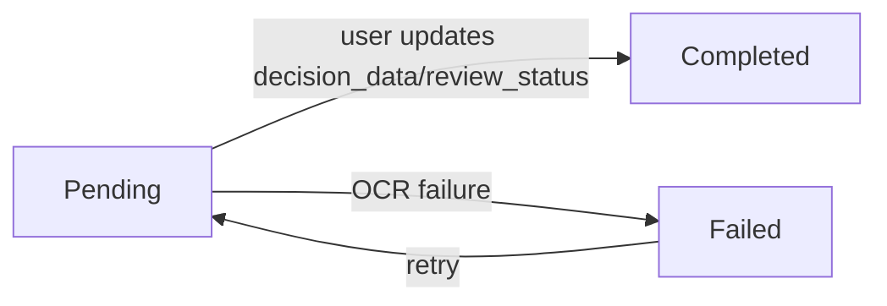

# Data Model: Review OCR/LLM Processed Data

## Entities

### 1. Review Decision (New Entity)

**Purpose**: Tracks user review decisions on OCR/LLM processed invoices

**Fields**:

| Field | Type | Description | Constraints |
|-------|------|-------------|-------------|
| id | :binary_id | Primary key | primary_key: true |
| extracted_content_id | :integer | Reference to extracted_content.id | null: false, foreign_key |
| user_id | :integer | Reference to users.id (who owns/made the decision) | null: false, foreign_key |
| review_status | :string | Current review status | null: false, default: "pending", inclusion: ["pending", "approved", "rejected", "amended", "failed"] |
| decision_type | :string | Type of decision | null: false, inclusion: ["initial", "approved", "rejected", "amended", "failed"] |
| decision_data | :map | Amended/corrected data from user review | null: true |
| original_data | :map | Snapshot of extracted data at review creation time | null: true |
| review_notes | :string | Optional notes about the decision | null: true, max_length: 1000 |
| review_completed_at | :naive_datetime | When the review was completed | null: true |
| status | :string | Process status of the review | null: false, default: "pending", inclusion: ["pending", "completed"] |
| created_at | :utc_datetime | When the review was created | null: false |
| updated_at | :utc_datetime | Last update timestamp | null: false |

**Relationships**:
- `belongs_to :extracted_content, ZaimuTomo.DocumentProcessing.ExtractedContent.ExtractedContent`
- `belongs_to :user, ZaimuTomo.Accounts.User`

**Indexes**:
- `[:extracted_content_id]` (for joining with extracted_content)
- `[:user_id]` (for filtering by owner)
- `[:review_status]` (for filtering by status)
- `[:created_at]` (for ordering by creation date)
- `[:extracted_content_id, :review_status]` (composite for common queries)

**Validation Rules**:
- `review_status` must be one of: ["pending", "approved", "rejected", "amended", "failed"]
- `decision_type` must be one of: ["initial", "approved", "rejected", "amended", "failed"]
- `status` must be one of: ["pending", "completed"]
- Foreign key constraints on `extracted_content_id` and `user_id`

**State Transitions**:


---

### 2. Extracted Content (Existing Entity - Updated)

**Purpose**: Stores OCR/LLM processed invoice data (existing from 001-persist-ocr-data)

**Updated Fields**:

| Field | Type | Description | Constraints |
|-------|------|-------------|-------------|
| user_id | :integer | Document owner/uploader ID | null: false, foreign_key |

**Existing Fields** (for reference):
- id: Primary key (binary_id)
- document_id: Source document reference (integer, foreign_key)
- extracted_data: Embedded ExtractedData struct with invoice fields
- status: Processing status ("success", "partial", "failed")
- analysis: Analysis metadata map
- error_details: Error information for failed extractions
- inserted_at, updated_at: Timestamps

**Relationships**:
- `belongs_to :document, ZaimuTomo.Documents.Document`
- `belongs_to :user, ZaimuTomo.Accounts.User`
- `has_many :review_decisions, ZaimuTomo.Review.ReviewDecision` (via extracted_content_id)

**Indexes Added**:
- `[:user_id]` (for ownership filtering and permissions)

---

### 3. Event Log (New Entity)

**Purpose**: Audit trail for review-related events

**Fields**:

| Field | Type | Description | Constraints |
|-------|------|-------------|-------------|
| id | :binary_id | Primary key | primary_key: true |
| event_type | :string | Type of event | null: false, inclusion: ["invoice_review:completed", "document_processing:success", "document_processing:failure"] |
| invoice_id | :string | Related invoice/extraction ID | null: true |
| user_id | :integer | User who triggered event | null: true, foreign_key |
| metadata | :map | Event-specific data | null: false |
| status | :string | Processing status | null: false, default: "pending", inclusion: ["pending", "processed", "failed"] |
| created_at | :utc_datetime | Event timestamp | null: false |
| updated_at | :utc_datetime | Last update | null: false |

**Relationships**:
- `belongs_to :user, ZaimuTomo.Accounts.User`

**Indexes**:
- `[:event_type]`
- `[:invoice_id]`
- `[:user_id]`
- `[:status]`
- `[:created_at]`

## Database Design Rationale

### Normalization Decision: Clear Separation of Concerns

**Chosen Approach**: 
- Minimal extension to `extracted_content` (only `user_id` for ownership)
- Comprehensive `review_decisions` table for all review-related data
- Dedicated `event_logs` table for audit trail

**Benefits of This Approach**:

1. **Single Responsibility Principle**:
   - `extracted_content`: Focuses solely on OCR/LLM processing data
   - `review_decisions`: Focuses on human review decisions and data amendments
   - `event_logs`: Focuses on audit trail

2. **Data Integrity**:
   - Review decisions are properly normalized with foreign key relationships
   - `original_data` stores a snapshot of extracted data at review time
   - `decision_data` stores user-amended data separately
   - Clear ownership via `user_id` on both extracted_content and review_decisions

3. **Performance Optimization**:
   - Common queries ("show me pending invoices") use simple filters on `review_decisions.review_status`
   - Detailed review operations use the dedicated `review_decisions` table
   - Joins between `review_decisions` and `extracted_content` for full data access
   - Composite indexes optimize frequent query patterns

4. **Scalability**:
   - Review process can evolve without affecting OCR data structure
   - Different retention policies can be applied to each table
   - Independent optimization for each data type

5. **Maintainability**:
   - Clear separation between machine-generated (OCR) and human-generated (review) data
   - Easier to understand and modify each component independently
   - Better alignment with domain concepts

## Database Schema Changes

### Migrations Required

1. **Add user_id to extracted_content** (for ownership):
   ```elixir
   add :user_id, :integer, null: false
   add foreign_key(:extracted_content, :users, column_name: :user_id)
   create index(:extracted_content, [:user_id])
   ```

2. **Create review_decisions table**:
   ```elixir
   create table(:review_decisions) do
     add :extracted_content_id, :integer, null: false
     add :user_id, :integer, null: false
     add :review_status, :string, default: "pending", null: false
     add :decision_type, :string, null: false
     add :decision_data, :map
     add :original_data, :map
     add :review_notes, :string
     add :review_completed_at, :naive_datetime
     add :status, :string, default: "pending", null: false
     timestamps(type: :utc_datetime)
   end
   
   create index(:review_decisions, [:extracted_content_id])
   create index(:review_decisions, [:user_id])
   create index(:review_decisions, [:review_status])
   create index(:review_decisions, [:created_at])
   create index(:review_decisions, [:extracted_content_id, :review_status])
   ```

3. **Create event_logs table**:
   ```elixir
   create table(:event_logs) do
     add :event_type, :string, null: false
     add :invoice_id, :string
     add :user_id, :integer
     add :metadata, :map, null: false
     add :status, :string, default: "pending", null: false
     timestamps(type: :utc_datetime)
   end
   
   create index(:event_logs, [:event_type])
   create index(:event_logs, [:invoice_id])
   create index(:event_logs, [:user_id])
   create index(:event_logs, [:status])
   create index(:event_logs, [:created_at])
   ```

## Data Flow

```mermaid
flowchart TD
    A[OCR/LLM Processing] -- document upload --> B[Worker.process/1]
    B -- success --> C[persist_and_emit_success/2]
    B -- failure --> D[persist_and_emit_failure/2]
    C -- creates ExtractedContent --> E[extracted_content table]
    C -- creates ReviewDecision --> F[review_decisions table]
    D -- creates ExtractedContent --> E
    D -- creates ReviewDecision --> F
    C -- emits --> G[document_processing:success]
    D -- emits --> H[document_processing:failed]
    F -- displays in --> I[/reviews LiveView]
    I -- user edits --> J[ReviewLive.Edit]
    J -- updates --> F
    J -- emits --> K[invoice_review:completed]
    K -- stored in --> L[event_logs table]
```

## Validation Rules

### Review Decision Validation

1. **Status Validation**:
   ```elixir
   review_status in ["pending", "approved", "rejected", "amended", "failed"]
   ```

2. **Decision Type Validation**:
   ```elixir
   decision_type in ["initial", "approved", "rejected", "amended", "failed"]
   ```

3. **Ownership Check** (in Review context):
   ```elixir
   # User can only review invoices they own
   query = from ec in ExtractedContent,
           join: rd in ReviewDecision, on: rd.extracted_content_id == ec.id,
           where: ec.user_id == ^current_user.id,
           where: rd.id == ^review_decision_id
   ```

### Extracted Content Validation

1. **Required Fields**:
   ```elixir
   document_id (required)
   user_id (required)
   status (required, inclusion: ["success", "partial", "failed"])
   ```

2. **Conditional Validation**:
   ```elixir
   # extracted_data must be present for non-failed status
   if status != "failed" and (extracted_data == nil or extracted_data == %{}) do
     add_error(changeset, :extracted_data, "is required for successful extractions")
   end
   ```

## Query Patterns

### Common Queries

1. **List all review decisions for a user (pending first)**:
   ```elixir
   from rd in ReviewDecision,
   join: ec in ExtractedContent, on: ec.id == rd.extracted_content_id,
   where: ec.user_id == ^current_user.id,
   order_by: [asc: rd.review_status == "pending", desc: rd.inserted_at]
   ```

2. **Get a specific review decision with authorization**:
   ```elixir
   from rd in ReviewDecision,
   join: ec in ExtractedContent, on: ec.id == rd.extracted_content_id,
   where: rd.id == ^id,
   where: ec.user_id == ^current_user.id
   ```

3. **Get review status counts for a user**:
   ```elixir
   ReviewDecision
   |> join(:left, [rd], ec in ExtractedContent, on: ec.id == rd.extracted_content_id)
   |> where([_, ec, rd], ec.user_id == ^user_id and rd.review_status in ["pending", "approved", "rejected", "amended"])
   |> group_by([_, _, rd], rd.review_status)
   |> select([_, _, rd], %{status: rd.review_status, count: count(rd.id)})
   ```

4. **Get pending reviews count for user**:
   ```elixir
   from rd in ReviewDecision,
   join: ec in ExtractedContent, on: ec.id == rd.extracted_content_id,
   where: rd.review_status == "pending",
   where: ec.user_id == ^current_user.id,
   select: count(rd.id)
   ```

## Performance Considerations

1. **Indexing Strategy**: All foreign keys and frequently queried fields are indexed
2. **Query Optimization**: Use Ecto's query builder for efficient joins
3. **Pagination**: Implement cursor-based pagination for review lists
4. **Date Formatting**: Use `DateTime.to_iso8601/1` and `Date.to_iso8601/1` for consistent display
5. **Batch Processing**: For bulk operations, use Ecto's `Repo.insert_all` where possible

## Data Integrity Measures

1. **Transactions**: All review operations wrapped in Ecto transactions
2. **Foreign Key Constraints**: Enforced at database level for `user_id` and `extracted_content_id`
3. **Audit Trail**: Comprehensive logging via EventLog table
4. **Validation**: Multi-layer validation (UI, changeset, database constraints)
5. **Snapshots**: `original_data` preserves extracted data state at review creation time
