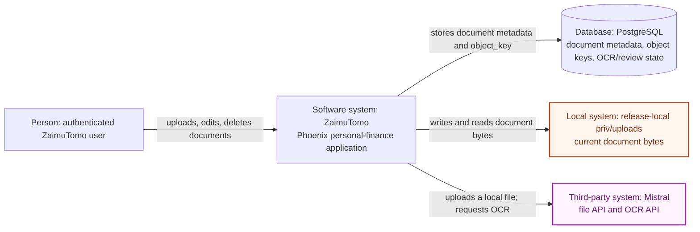
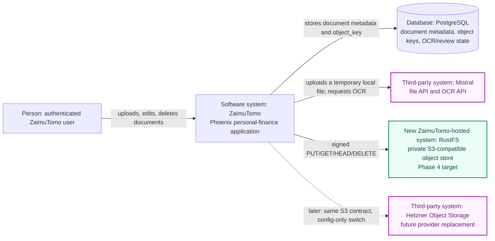
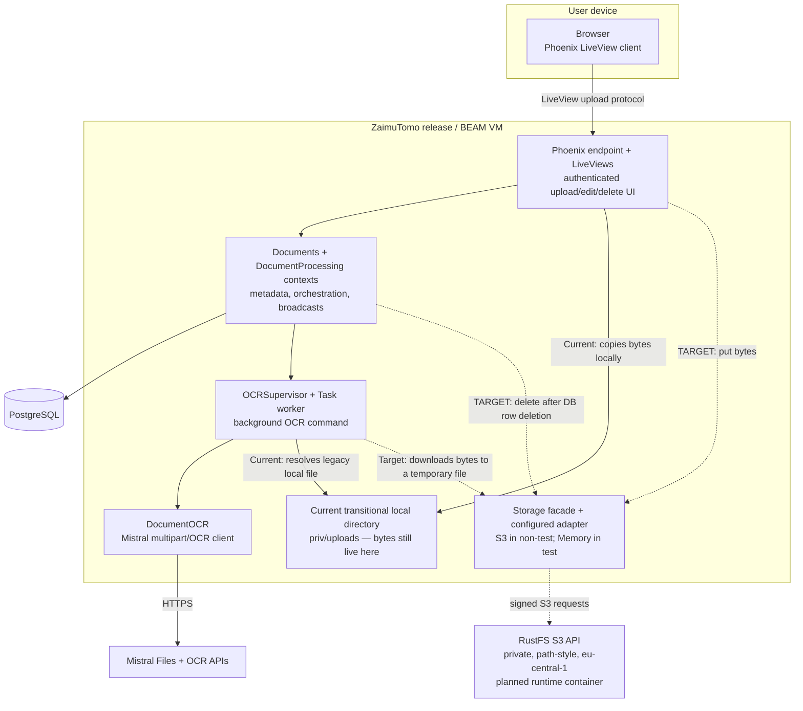
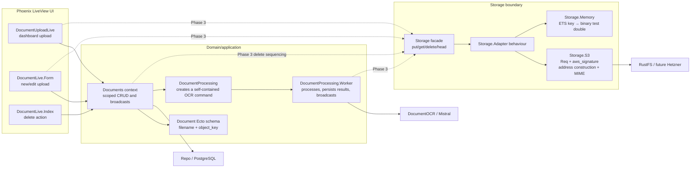
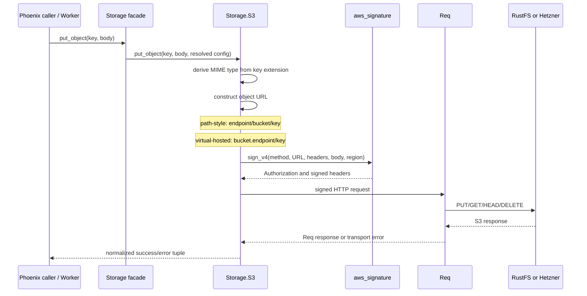

# C4 model — S3-compatible document storage

## Scope and status

This model covers the document-byte storage feature: moving ZaimuTomo’s evidence files from the Phoenix release-local `priv/uploads` directory to a private, S3-compatible object store.

**Implemented through Phase 2:**

- `documents.object_key` is the database identity, replacing `filepath`.
- `ZaimuTomo.Storage` provides `PUT`, download-to-file, `HEAD`, and `DELETE` through S3 and Memory adapters.
- The S3 adapter uses `Req` plus SigV4 signing, supports path-style and virtual-hosted addresses, and derives `Content-Type` from the key.
- Tests use the ETS-backed Memory adapter, not a live endpoint.

**Not implemented yet (Phase 3 onward):**

- Production upload/OCR/delete flows calling `Storage`.
- RustFS runtime/container infrastructure and the bucket.
- Existing-file migration, `verify_storage`, and backup/restore operational tooling.

Therefore, the current application persists `documents/<name>` keys but still stores bytes in `priv/uploads`. The target architecture is the desired end-state; it is not yet the live data plane.

---

## C1 — System context

### Current context — Phase 2 bridge

At this point the database already has portable `documents/...` keys, but the bytes remain coupled to the application release through `priv/uploads`.

### Target context — private object storage

The change is intentionally confined to byte ownership: PostgreSQL remains the metadata authority, and the browser and Mistral still communicate only with ZaimuTomo.

**Legend:** the purple background and border identify a third-party-operated service. The amber node is the transitional release-local byte store. The green node is a new ZaimuTomo-hosted target component. The dashed Hetzner relationship is a later provider migration.

### Context decisions

1. The browser is never an S3 client. The bucket remains private and all document access is mediated by ZaimuTomo.
2. PostgreSQL owns document metadata and the opaque portable key; object storage owns bytes. `filename` remains the original client filename.
3. Mistral cannot fetch a RustFS presigned URL while RustFS is VPN-private. The application performs both network legs: object-store GET to a temp file, then multipart upload to Mistral.
4. RustFS is the first provider. Hetzner is intentionally outside the current implementation: it should replace only endpoint/credentials/addressing configuration, not application code.
5. Mistral is the current third-party recipient of document bytes. RustFS is the new ZaimuTomo-hosted byte authority in the target architecture. Hetzner becomes a third-party object-store operator only in the later provider-migration workstream.

---

## C2 — Container model

| Container | Responsibility | Current state |
|---|---|---|
| Browser | Authenticated upload/edit/delete UI; does not receive storage credentials. | Existing |
| Phoenix/BEAM release | Owns validation, object-key generation, metadata persistence, OCR orchestration, and future compensation/deletion ordering. | Existing |
| PostgreSQL | `documents.filename`, `documents.object_key`, ownership, extraction/review/journal state. | `object_key` migration complete |
| RustFS | Private durable object bytes, initially one bucket per environment. | Designed; not deployed/wired |
| Mistral | Receives an app-originated multipart file and returns OCR output. | Existing |
| Memory adapter / Req.Test | Fast hermetic test infrastructure, not a deployed runtime container. | Existing |

---

## C3 — Phoenix component model

### Component ownership

| Component | Owns | Important boundary |
|---|---|---|
| `DocumentUploadLive` and `DocumentLive.Form` | Browser upload consumption and user feedback. | They must not retain S3 credentials or choose a provider. Both currently copy to local disk. |
| `Documents` | Scope enforcement, document row CRUD, DB constraints, broadcasts. | It is the authoritative owner of row deletion. Phase 3 must invoke object deletion only after `Repo.delete` succeeds. |
| `Document` schema | Persisted identity: `filename` plus required `object_key`. | The key is not a URL or filesystem path. |
| `DocumentProcessing` | Captures the document owner’s currency into the dispatch command. | The worker does not need to look up the user to build its extraction prompt. |
| `Worker` | OCR orchestration, extracted-content/review persistence, PubSub outcomes. | It should receive a temp path from Storage in Phase 3 while `DocumentOCR` remains path-oriented. |
| `Storage` | Provider-neutral object operation API. | Callers know only opaque keys and success/error results. |
| `Storage.S3` | URL/address-style construction, SigV4 request signing, HTTP response mapping, MIME inference. | RustFS details must stay here/configuration; provider features must not escape into domain code. |
| `Storage.Memory` | Deterministic test behavior using `{object_key, binary}` entries in ETS. | It is not migration storage or a production fallback. |

---

## C4 level 4 — `Storage.S3` internals

The essential portability rule is that the SigV4 signer receives the exact host and path created by the address-style decision. RustFS uses path-style now; a later Hetzner deployment changes `S3_ENDPOINT`, credentials, and `S3_PATH_STYLE=false` while retaining the same key format and facade API.

---

## Key flows

### Current transitional flow (implemented)

1. A LiveView consumes the browser upload and copies it to `priv/uploads`.
2. It writes `documents/<name>` to `documents.object_key` in PostgreSQL.
3. `DocumentProcessing` starts a supervised task with the document and a snapshot of the owner’s currency.
4. The worker takes `Path.basename(object_key)`, rebuilds the legacy local path, and passes that path to `DocumentOCR`.
5. `DocumentOCR` reads the file and uploads it to Mistral.

This bridge keeps Phase 2 deployable, but it means object storage is not yet the byte authority.

### Target flow (Phase 3)

1. LiveView consumes an uploaded temp file and generates `documents/<uuid>.<ext>`.
2. It calls `Storage.put_object(key, bytes)`; the adapter sets MIME metadata.
3. It creates/updates the document row with `object_key` only.
4. If the DB operation fails after a successful PUT, it best-effort deletes the newly written key.
5. The worker calls `Storage.get_object(object_key, temp_path)`, invokes unchanged `DocumentOCR.process(temp_path)`, and removes the temp file in an `after` block.
6. A delete first removes the row (respecting FK constraints), then best-effort deletes the object. A failed object deletion leaves a detectable orphan rather than removing evidence for an undeletable row.

---

## Architectural invariants and risks

### Invariants to preserve

- **Opaque portable identity:** Persist only `documents/<uuid>.<ext>`. Never persist `/uploads/...`, `s3://...`, an endpoint URL, or an OS path.
- **Private application-mediated access:** Browser and Mistral do not need object-store credentials or direct RustFS network access.
- **One owner per concern:** PostgreSQL is authoritative for document existence; storage is authoritative for bytes; `Documents` owns row lifecycle; `Storage.S3` owns S3 mechanics.
- **No false transaction claim:** PostgreSQL and S3 do not share a transaction. The design intentionally uses ordered writes and compensating cleanup, then detects remaining drift with `verify_storage`.
- **Provider-neutral configuration:** Application code consumes only `S3_*` settings. RustFS-specific port, image, bucket provisioning, and object-lock settings belong in infrastructure.
- **Layered tests:** Memory and `Req.Test` stay default; a tagged RustFS Testcontainers suite proves real interoperability later without making normal tests Docker-dependent.

### Gaps / decisions for Phase 3

1. **The storage boundary has no production caller yet.** The facade, adapters, configuration, and tests exist, but code search shows no use of `Storage.put_object`, `get_object`, `delete_object`, or `head_object` outside the storage modules/tests. This is intentional sequencing, but the current release still relies on `priv/uploads`.
2. **Upload compensation is duplicated by shape.** Two LiveViews upload document bytes. Phase 3 should make the compensation sequence explicit and identical in both paths: PUT → DB write → delete new key on DB failure. Either keep it caller-owned as the plan describes or make `Documents` own a narrowly scoped orchestration function; do not leave each path with subtly different cleanup behavior.
3. **Replacement must retain the old key until DB success.** On edit, the new key must be cleaned if the update fails, and the old key may be deleted only after success. Keys should be generated by one shared key-generation rule rather than deriving identity from a temporary filename.
4. **Temporary files require ownership discipline.** The worker needs `try ... after File.rm(temp_path) end`, including failures after download, so retryable OCR does not accumulate app-node files.
5. **Durability remains an operational dependency.** RustFS plus PostgreSQL must be restored coherently: object backup/export first, database dump second, then `verify_storage`. A live filesystem walk of RustFS data is not automatically a valid backup.

---

## Evidence in the checked-out Phase 2 branch

- Target intent, data flow, private-bucket policy, temp-file OCR, and object-key migration: `specs/003-s3-document-storage/spec.md:30-55`, `:57-189`, `:260-305`.
- Current implementation plan and phase boundaries: `specs/003-s3-document-storage/plan.md:12-62`.
- Provider-neutral public facade and adapter contract: `lib/zaimu_tomo/storage.ex:1-26`, `lib/zaimu_tomo/storage/adapter.ex:1-13`.
- S3 HTTP/signing/addressing implementation: `lib/zaimu_tomo/storage/s3.ex:8-105`.
- Test-only ETS behavior: `lib/zaimu_tomo/storage/memory.ex:8-58` and `config/test.exs:30`.
- Current database contract: `lib/zaimu_tomo/documents/document.ex:7-23`.
- Current local-file bridge: `lib/zaimu_tomo_web/live/document_upload_live.ex:107-130`, `lib/zaimu_tomo_web/live/document_live/form.ex:131-179`, and `lib/zaimu_tomo/document_processing/ocr_worker.ex:19-24,136-138`.
- Current row-delete authority/FK behavior: `lib/zaimu_tomo/documents.ex:142-160`.
- Runtime configuration defaults: `config/config.exs:56-63`, `config/runtime.exs:32-40`.
