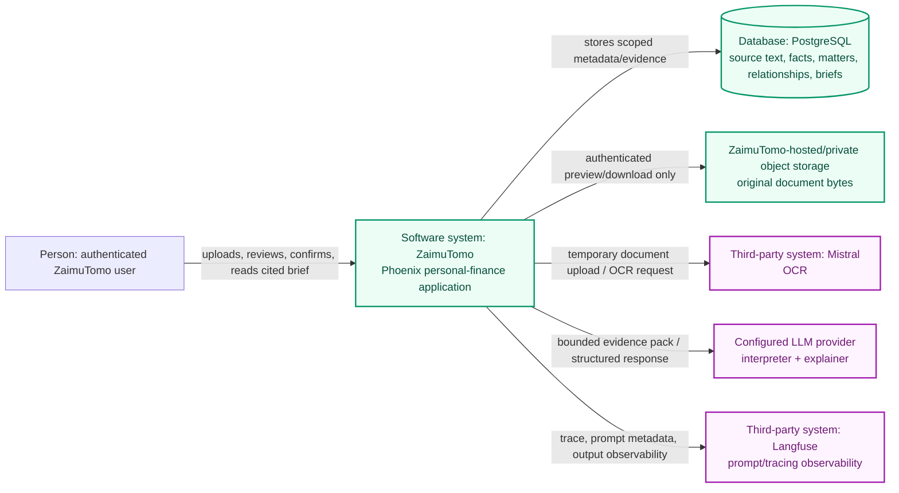
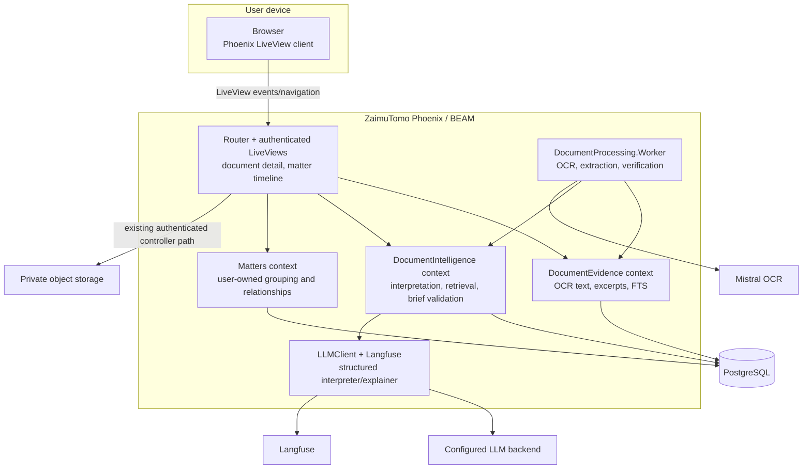
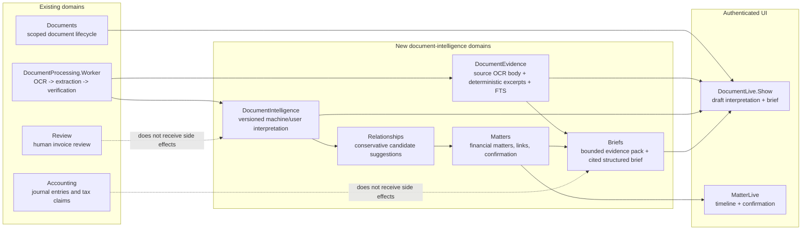
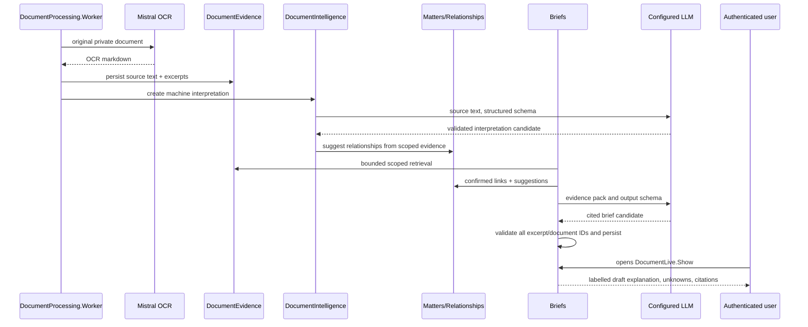

# C4 Model: Document Matters and Evidence-Grounded Briefs

## Scope

This model describes the proposed first release: a private, cited **Document brief** and a user-maintained document-matter timeline. It does not include free-form chat or a vector database.

## C1 — System context

**Legend:** purple nodes are third-party-operated services. Green nodes are
ZaimuTomo-owned components and data stores. The user is an external person
interacting with the application.

### Context decisions

1. The browser never gets raw database access, object-store credentials, or another user's evidence.
2. PostgreSQL owns app-facing source text, citations, matters, relationships, and brief state. Object storage owns original bytes.
3. LLM providers receive a bounded evidence pack, not the archive or an unrestricted SQL/search capability.
4. Langfuse is observability and prompt management. It is not the durable citation store.
5. The document brief is descriptive only. Accounting, tax claims, and payment actions retain their existing human-owned flows.

## C2 — Container model

## C3 — Component model

## Key flow — automatic document brief

## Invariants

- All new public context functions accept `current_scope` first and return inaccessible entities as not found.
- A document link/relationship cannot cross `user_id` boundaries.
- The UI cannot render a material brief claim without a source excerpt citation.
- User corrections and confirmed/rejected links are preserved separately from machine output and take effective precedence.
- Source document deletion invalidates/removes derived evidence and current brief state; no citation can point at a deleted source.
- The explainer cannot execute a financial action. It only receives an evidence pack and returns a validated data structure.

## Future extensions, intentionally outside this model

- Guided questions reuse the same `Briefs` evidence-pack path.
- Free-form chat requires a separate interaction, persistence, safety, and evaluation design.
- Optional `pgvector` would sit beside FTS in PostgreSQL and return excerpt IDs into the same evidence-pack contract; it would not alter authorization or citation validation.
