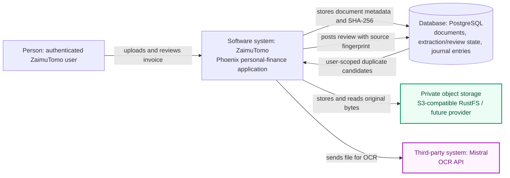
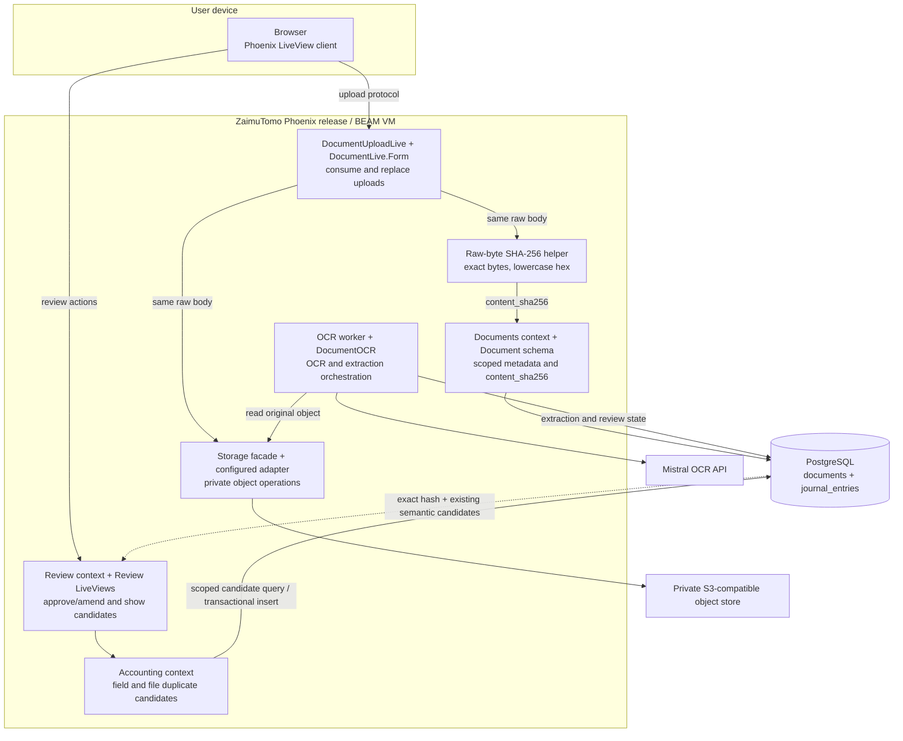
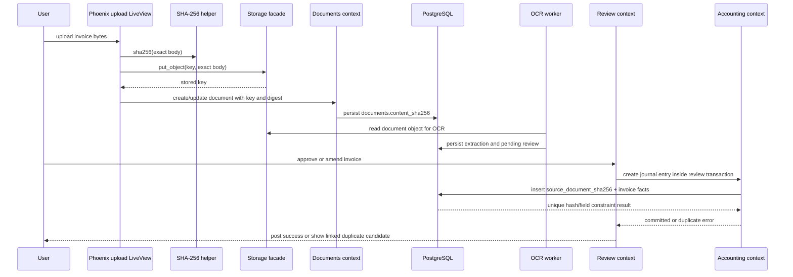

# C4 Model — Exact-Byte Invoice File Fingerprints

## Scope and status

This proposed feature adds exact-byte invoice identity to the existing duplicate-invoice review flow. It does not change the OCR/LLM pipeline and does not implement perceptual or OCR-text similarity.

**Status:** design only. The runtime fingerprint fields, backfill task, unique index, and UI behavior described below are proposed, not implemented.

## C1 — System context

PostgreSQL remains authoritative for document metadata, review state, journal entries, and duplicate constraints. The object store remains authoritative for the original bytes. The SHA-256 value is derived metadata—not a replacement for the stored object or invoice fields.

## C2 — Container model

## C3 — Component responsibilities and proposed data flow

### Ownership rules

| Component | Owns | Boundary |
|---|---|---|
| Upload LiveViews | Consume the incoming bytes and coordinate storage plus row persistence. | Hash exactly the body passed to storage; do not accept a client-supplied digest. |
| SHA-256 helper | Deterministic byte-to-digest conversion. | No OCR, storage, database, user, or AI dependencies. |
| `Documents` / `Document` | Current object key and its `content_sha256`. | Update key and digest together when uploaded bytes are replaced. |
| `Review` | Approval/amendment transaction and ownership scope. | Keep the journal insert, review update, claim, and event in the existing transaction. |
| `Accounting` / `JournalEntry` | Candidate lookup and posted source fingerprint. | Persist the posting-time digest; PostgreSQL uniqueness is the race-safe guard. |
| `Storage` | Provider-neutral reads/writes for original bytes. | Backfill and runtime flows use the facade; no direct bucket access from UI/domain code. |
| PostgreSQL | Authoritative scoped metadata and posting uniqueness. | Partial unique index is per user and excludes null legacy hashes. |

## Duplicate-match order

1. Exact same-user source-document SHA-256: strong, blocking match; display “same uploaded file” and link to the existing entry.
2. Existing `(user, issuer, invoice number)` match: strong, blocking match.
3. Existing exact `(issuer, date, amount, currency)` tuple: possible duplicate; preserve the current warning and explicit confirmation flow.

If a candidate matches more than one rule, show it once and display the strongest applicable reason. A null fingerprint never matches. A digest from a different user is never queried or shown.

## Backfill boundary

The schema migration only adds columns and indexes. A separate idempotent task reads each existing object's bytes through `ZaimuTomo.Storage`, computes `documents.content_sha256`, and copies the corresponding value to posted journal entries. It reports inaccessible objects and same-user journal collisions. The partial unique index is created only after preflight; collisions require human ledger review. No document bytes are sent to OCR/LLM again, and no ledger row is automatically removed.
