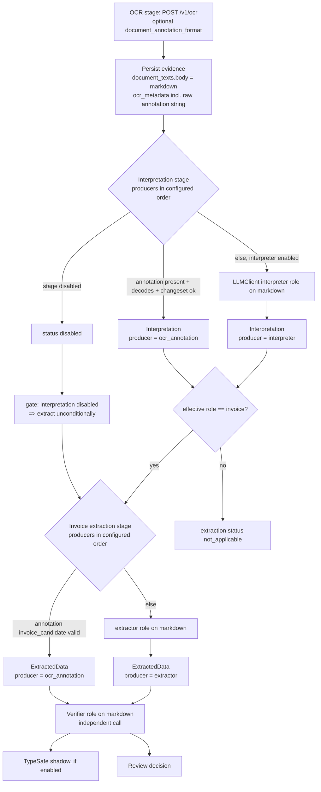

# Feature Specification: Interpreter-First Document Pipeline with Optional Mistral Document Annotation

**Feature branch**: `feat/interpreter-first-pipeline` (implementation; this document branch is `docs/ocr-document-annotation`)
**Created**: 2026-09-29
**Status**: Proposed. Docs only; no production code, and no live Mistral calls were made to write it.
**Depends on**: PR #61 (`specs/004-document-matters`) for `document_texts` and `document_interpretations`, and on the Oban stack (durable, job-based stages). It assumes job-based stages but does not depend on Oban internals.
**Input**: The user chose **option (c)**: interpret every document first, then run invoice extraction only when the role is `invoice`. The open question is whether Mistral OCR's `document_annotation` can do the interpretation (and maybe the invoice facts) inside the OCR request that already happens, and how to add it without creating a Mistral-only path that rots.

## 1. Answer in brief

**Yes, but treat it as an optimization, not the foundation.**

- Mistral OCR can return a JSON-schema-constrained `document_annotation` in the same `/v1/ocr` response as the page markdown. It can express the #61 interpretation contract. See `research.md` §1 for sources.
- It does **not** remove an inference stage. Mistral runs OCR and then sends the markdown plus up to the first eight image bounding boxes to a separate LLM. For OCR 4 that LLM is `mistral-small-2603`, and the request cannot choose or pin it.
- It does **not** save money. Annotated pages cost $5/1000 instead of $4/1000 on OCR 4.x. That is +$0.001 per page, charged per page rather than per token. For a typical 1–3 page letter, one direct Mistral Small 4 interpreter call on the markdown costs about the same or less (`research.md` §2). The possible gains are one fewer network round trip, some image context, and nothing to run on the local NPU.
- It has hard gaps that a portable path must cover anyway:
  - Mistral's own cookbook limits document annotation to 8 pages.
  - Non-Mistral OCR configurations cannot use it.
  - Output may be null or malformed.

**Therefore:** build the provider-neutral **`:interpreter` role on persisted markdown first**. It is required regardless. Then add Mistral annotation as a second **producer** of the same `Interpretation` contract, disabled by default. Enable it only if the spike (`plan.md` §5) shows it matches the interpreter's accuracy and gives a measurable latency win. Both producers feed **one** downstream path. The interpreter producer runs in production for every >8-page document, so it cannot rot. The Mistral-specific code stays small: a request-builder option and a decoder. Contract tests cover both.

## 2. Goals and non-goals

### Goals

- **G1 — Interpretation first.** Every processed document gets an interpretation (role, issuer, subject, references, periods, obligations) before any invoice-specific work.
- **G2 — One contract, one downstream path.** Annotation and the interpreter role produce the same validated `Interpretation`. Nothing downstream branches on which producer made it.
- **G3 — Invoice extraction only for invoices.** `ExtractedData` and its required fields apply only to documents whose effective role is `invoice`.
- **G4 — Evidence before judgment.** OCR markdown and the raw annotation string are persisted before anything is decoded or validated. A failed annotation never forces a second OCR call. The one possible exception is a request that the API rejects outright (US3.3), and it is recorded when it happens.
- **G5 — Independent verification.** The verifier and TypeSafe never judge output with the same call, model, or prompt that produced it.
- **G6 — Explicit configuration.** Every new AI stage is disabled by default through an explicit `enabled` flag. A disabled stage writes status `"disabled"`. No stage silently falls back to another producer: every fallback is configured and recorded.
- **G7 — No legacy residue.** Each phase lists the code it deletes (`plan.md` §4).

### Non-goals

- Replacing Mistral as the OCR provider.
- Bounding-box/image annotation (`bbox_annotation_format`). It is not needed for interpretation.
- Removing the verifier or TypeSafe shadow verification.
- Matters, relationships, and briefs. Those stay in #61.
- Batch OCR. Uploads are interactive, and the 50% batch discount does not justify the queueing latency.

## 3. Pipeline (target state)

Each box is a job-based stage with a self-contained command, for example `%{document_id, document_text_id, currency_hint}`. Each stage writes its own status row, and retrying a stage never repeats an earlier stage.

## 4. User stories and acceptance scenarios

### US1 — A tax letter is not forced through the invoice schema (P1)

1. Given a Swiss final tax assessment, when it is processed, then its interpretation has role `tax_assessment` and its tax period, and no invoice extraction runs. Extraction status is `not_applicable`, not `failed`.
2. Given a provisional tax bill and the prior year's reconciliation, then each gets its own role and period, and the two interpretations do not share obligations.

### US2 — An invoice still reaches review with verified facts (P1)

1. Given a single-page invoice, then its role is `invoice`, `ExtractedData` passes `ExtractedData.changeset/1`, the verifier runs, and a review decision exists, just as today.
2. The review UI shows which producer supplied the facts (`ocr_annotation` or `extractor`).

### US3 — Annotation failure degrades explicitly (P1)

1. Given an annotation that is null, not valid JSON, or rejected by the changeset, and the interpreter listed after annotation in the producer list, then the interpreter runs on the **persisted** markdown, no second OCR request is made, and the interpretation's `model_metadata` records `annotation_status` (`absent` | `invalid_json` | `invalid_domain`).
2. Given the same failure and no fallback producer configured, then interpretation status is `failed` with those details. It is never `disabled` and never blank.
3. Given a document with more than 8 pages and annotation enabled, the interpreter produces the interpretation, and markdown for **every** page is persisted. The spike must establish what the API actually does in this case (`research.md` §3, F2):
   - if the annotation comes back null or truncated, US3.1 applies;
   - if the request is rejected, the OCR stage must retry without annotation. That retry is the only case where a second OCR request is allowed, and it must be recorded.

### US4 — Non-Mistral OCR behaves identically downstream (P1)

1. Given a configuration with annotation disabled, or any future OCR backend without annotation support, then the interpreter role produces the same `Interpretation` struct. The extraction, verifier, review, and TypeSafe stages have no producer-specific branches.

### US5 — A user corrects a misclassification (P1)

1. Given a document interpreted as `other` that is actually an invoice, when the user sets its role to `invoice`, then a user interpretation row is created (per #61's precedence rules) and the invoice extraction stage is enqueued for that document.
2. A machine interpretation of `invoice` that the user changes to another role marks any existing extraction `superseded` rather than deleting it.

### US6 — Traces show full inputs and outputs (P2)

1. When annotation is used, Langfuse shows an `ocr-document-annotation` generation. Its input is the annotation prompt, the schema, and the schema version, and its output is the raw annotation string. Usage is `pages_processed`, because Mistral reports no tokens for annotation.

## 5. Precedence and disagreement

| Field family | Owner | Precedence (high → low) |
|---|---|---|
| role, issuer (as classification), subject_label, reference_numbers, periods, obligations | `Interpretation` | user interpretation → latest `ready` machine interpretation (whichever producer) |
| amount_to_pay_cents, invoice_date, invoice_number, currency, reason_for_payment, issuer (as payee) | invoice facts | human-reviewed `ReviewDecision` → `ExtractedContent.extracted_data` (verified, any producer) → **never** the interpretation |

Rules:

- Interpretation obligations are never copied into `ExtractedData`, and invoice facts are never written back into an interpretation.
- **Disagreement** is recorded, not resolved automatically. After extraction, a pure function compares interpretation issuer and obligations with extracted issuer and amount/currency. It writes `analysis["disagreements"]`, a list of `{field, interpretation_value, extraction_value}`. Any disagreement marks the review item as needing attention in the UI, the same way a verifier warning does. It never blocks posting on its own.
- A role disagreement cannot occur automatically, because extraction runs only for `invoice`. A user role change goes through US5.

## 6. Success criteria

- **SC1**: Role accuracy on the fixture corpus is at least 95%, and **invoice recall is 100%**: no invoice is classified as a non-invoice. Missing an invoice silently drops it from accounting.
- **SC2**: Invoice field exact-match for the enabled producer is at least as good as the current extractor, field by field.
- **SC3**: Every annotation failure mode in `research.md` §3 has a hermetic test that ends in a durable, explicit status.
- **SC4**: No default test makes a real OCR, LLM, Langfuse, or TypeSafe call.
- **SC5**: After Phase 2 (`plan.md`), `Worker.process/1` no longer contains the extractor → verifier `with` chain, and no code path runs invoice extraction before interpretation (except the documented `interpretation disabled` gate).

## 7. Open questions (need a user decision)

See `plan.md` §6.
